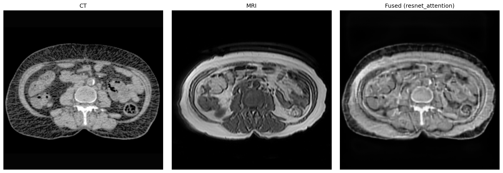

# Comprehensive Analysis of ResNet Attention Finetuning Medical Model

## Table of Contents
1. [Introduction](#introduction)
2. [How It Works](#how-it-works)
3. [Why This Approach](#why-this-approach)
4. [What Makes It Special](#what-makes-it-special)
5. [Architecture Breakdown](#architecture-breakdown)
6. [Training Methodology](#training-methodology)
7. [Error Metrics and Evaluation](#error-metrics-and-evaluation)
8. [Medical-Specific Adaptations](#medical-specific-adaptations)
9. [Implementation Details](#implementation-details)
10. [Example Workflow](#example-workflow)
11. [Results and Benefits](#results-and-benefits)
12. [Conclusion](#conclusion)

## Introduction

The ResNet Attention Finetuning Medical Model represents an advanced deep learning approach specifically designed for medical image fusion, particularly CT-MRI fusion. This model adapts a pre-trained ResNet34 backbone from visible-infrared fusion tasks and fine-tunes it for medical imaging applications, incorporating attention mechanisms and medical-specific optimizations.

## How It Works

### Core Process Flow
1. **Input Processing**: CT and MRI images are preprocessed with medical-specific techniques
2. **Dual Encoding**: Separate ResNet34 encoders process CT (3-channel) and MRI (1-channel) images
3. **Multi-Scale Fusion**: Features are fused at 4 different scales using attention mechanisms
4. **Medical Attention Refinement**: Final output is refined with medical-specific attention
5. **Output Generation**: Produces 3-channel RGB fusion suitable for medical visualization

### Key Workflow Steps
```
CT Image → Medical Preprocessing → CT Encoder → Multi-Scale Fusion → Medical Attention → Fused Output
MRI Image → Medical Preprocessing → MRI Encoder → 
```

## Why This Approach

### Medical Imaging Challenges
- **Modalities Difference**: CT provides anatomical structure, MRI provides soft tissue contrast
- **Clinical Requirements**: Fusion must preserve diagnostic information from both modalities
- **Data Scarcity**: Medical images are expensive to acquire and annotate
- **Quality Standards**: Must maintain clinical interpretability

### Why ResNet + Attention?
- **Transfer Learning**: Leverages pre-trained features from general fusion tasks
- **Attention Mechanisms**: Focuses on diagnostically relevant regions
- **Multi-Scale Processing**: Captures both fine details and global context
- **Medical Optimization**: Specialized loss functions for clinical requirements

## What Makes It Special

### Unique Features
1. **Dual Encoder Architecture**: Separate encoders for different modality characteristics
2. **Medical-Specific Loss Function**: Weighted loss components for clinical relevance
3. **Progressive Fine-Tuning**: Careful unfreezing strategy to preserve pre-trained knowledge
4. **Attention at Multiple Levels**: Spatial, channel, and medical-specific attention
5. **Medical Preprocessing Pipeline**: CT windowing, intensity normalization, contrast enhancement

### Innovation Aspects
- **Modality Adaptation**: CT encoder uses 3-channel input, MRI uses 1-channel with weight averaging
- **Medical Attention Layer**: Additional attention mechanism for diagnostic region emphasis
- **Gradient Clipping**: Prevents training instability in medical fine-tuning
- **Mixed Precision Training**: Efficient training with automatic mixed precision

## Architecture Breakdown

### Overall Architecture
```
Input: CT (256x256x3), MRI (256x256x1)
       ↓
CT Encoder (ResNet34)    MRI Encoder (ResNet34)
       ↓                        ↓
Features: c1,c2,c3,c4    Features: m1,m2,m3,m4
       ↓                        ↓
Fusion Blocks (4 scales): f1,f2,f3,f4
       ↓
Decoder with Skip Connections
       ↓
Medical Attention Layer
       ↓
Output: Fused Image (256x256x3)
```

### Component Details

#### 1. CT Encoder
- **Input**: 3-channel CT image (converted from grayscale)
- **Backbone**: ResNet34 with ImageNet initialization
- **Output Features**: 4 scales (64, 128, 256, 512 channels)
- **Purpose**: Extract structural and anatomical features

#### 2. MRI Encoder
- **Input**: 1-channel MRI image
- **Backbone**: ResNet34 with averaged weights from RGB
- **Adaptation**: Single channel input with weight averaging
- **Output Features**: 4 scales matching CT encoder
- **Purpose**: Extract soft tissue and functional features

#### 3. Attention Mechanisms

**Spatial Attention**:
```python
class SpatialAttention(nn.Module):
    def __init__(self, in_channels):
        super().__init__()
        self.conv = nn.Conv2d(in_channels, 1, kernel_size=7, padding=3)
        self.sigmoid = nn.Sigmoid()
        
    def forward(self, x):
        attention = self.conv(x)
        attention = self.sigmoid(attention)
        return x * attention
```

**Channel Attention**:
```python
class ChannelAttention(nn.Module):
    def __init__(self, in_channels, reduction=16):
        super().__init__()
        self.avg_pool = nn.AdaptiveAvgPool2d(1)
        self.fc = nn.Sequential(
            nn.Linear(in_channels, in_channels // reduction, bias=False),
            nn.ReLU(inplace=True),
            nn.Linear(in_channels // reduction, in_channels, bias=False),
            nn.Sigmoid()
        )
```

**Dual Attention Fusion**:
```python
class DualAttentionFusion(nn.Module):
    def __init__(self, channels):
        super().__init__()
        self.channel_attention = ChannelAttention(channels)
        self.spatial_attention = SpatialAttention(channels)
        
        self.fusion_conv = nn.Sequential(
            nn.Conv2d(channels * 2, channels, 3, padding=1),
            nn.BatchNorm2d(channels),
            nn.ReLU(inplace=True),
            nn.Conv2d(channels, channels, 3, padding=1),
            nn.BatchNorm2d(channels),
            nn.ReLU(inplace=True)
        )
```

#### 4. Decoder Architecture
- **Transposed Convolutions**: Progressive upsampling
- **Skip Connections**: Concatenation with encoder features
- **Batch Normalization**: Stability and faster convergence
- **Final Activation**: Sigmoid for [0,1] medical image range

#### 5. Medical Attention Layer

The Medical Attention Layer is a specialized attention mechanism applied to the final fusion output to enhance diagnostic quality:

**Architecture**:
```python
self.medical_attention = nn.Sequential(
    nn.Conv2d(3, 16, 3, padding=1),
    nn.ReLU(inplace=True),
    nn.Conv2d(16, 3, 1),
    nn.Sigmoid()
)
```

**Detailed Operation**:
1. **Feature Expansion**: 3×3 convolution increases channels from 3 to 16 for richer feature representation
2. **Non-linear Processing**: ReLU activation enables complex pattern learning
3. **Attention Generation**: 1×1 convolution creates per-pixel attention weights for each RGB channel
4. **Final Refinement**: Element-wise multiplication with original output emphasizes diagnostically important regions

**Medical-Specific Learning**: The layer learns to identify and enhance regions critical for clinical diagnosis, such as:
- Anatomical boundaries visible in both modalities
- Pathological regions with complementary information
- Areas requiring high diagnostic precision

This final attention step ensures the fused image maintains clinical interpretability while maximizing information content from both CT and MRI modalities.

### How Spatial Attention Works (Step-by-Step):

1. **Input Feature Map**: Receives feature maps from encoder layers (e.g., 64×64×256 for layer 3)
2. **Convolution Operation**: 7×7 convolution reduces channels from C to 1, creating spatial attention map
   ```
   Input: [B, C, H, W] → Convolution(7×7) → [B, 1, H, W]
   ```
3. **Sigmoid Activation**: Converts attention values to [0,1] range
   ```
   Attention Map = σ(W_conv * Input + b)
   ```
4. **Element-wise Multiplication**: Weights each spatial location
   ```
   Output = Input ⊙ Attention_Map
   ```
5. **Medical Relevance**: In CT-MRI fusion, this highlights regions like:
   - Bone boundaries in CT images
   - Tissue interfaces in MRI images
   - Anatomical landmarks visible in both modalities

### How Channel Attention Works (Step-by-Step):

1. **Global Average Pooling**: Compresses spatial dimensions to 1×1 per channel
   ```
   Input: [B, C, H, W] → AvgPool → [B, C, 1, 1]
   ```
2. **Channel-wise Statistics**: Each channel becomes a single scalar value
   ```
   Channel_Stats = [μ₁, μ₂, μ₃, ..., μ_C] where μ_i = Average of channel i
   ```
3. **Dimensionality Reduction**: First FC layer reduces channels (e.g., 256 → 16)
   ```
   Reduced = ReLU(W₁ * Channel_Stats + b₁)
   ```
4. **Channel Weight Generation**: Second FC layer generates attention weights
   ```
   Attention_Weights = σ(W₂ * Reduced + b₂)
   ```
5. **Broadcasting**: Expand weights to match input spatial dimensions
   ```
   Weights: [B, C, 1, 1] → [B, C, H, W] (broadcasted)
   ```
6. **Channel-wise Scaling**: Multiply each channel by its attention weight
   ```
   Output[B,C,H,W] = Input[B,C,H,W] × Attention_Weights[B,C,1,1]
   ```
7. **Medical Relevance**: Emphasizes channels containing:
   - Bone density patterns in CT
   - Tissue contrast variations in MRI
   - Diagnostic feature representations

### How Dual Attention Fusion Works (Step-by-Step):

1. **Independent Attention Application**:
   ```
   CT_Attended = Spatial_Attention(Channel_Attention(CT_Features))
   MRI_Attended = Spatial_Attention(Channel_Attention(MRI_Features))
   ```

2. **Feature Concatenation**: Combine attended features from both modalities
   ```
   Combined = Concat(CT_Attended, MRI_Attended) along channel dimension
   Input: [B, C, H, W] and [B, C, H, W] → [B, 2C, H, W]
   ```

3. **Fusion Convolution**: Learn optimal combination of attended features
   ```
   Fused = Conv2D(2C → C) → BatchNorm → ReLU → Conv2D(C → C) → BatchNorm → ReLU
   ```

4. **Multi-Scale Integration**: This process repeats at 4 different scales:
   - Scale 1: 64 channels (early features)
   - Scale 2: 128 channels (mid-level features)
   - Scale 3: 256 channels (high-level features)
   - Scale 4: 512 channels (deep semantic features)

### How Medical Attention Works (Step-by-Step):

1. **Input Processing**: Takes final 3-channel RGB fusion output
2. **Feature Extraction**: 3×3 convolution expands to 16 channels for richer representation
   ```
   Input: [B, 3, H, W] → Conv(3×3) → [B, 16, H, W]
   ```
3. **Non-linear Processing**: ReLU activation for feature learning
4. **Attention Generation**: 1×1 convolution reduces back to 3 channels
   ```
   [B, 16, H, W] → Conv(1×1) → [B, 3, H, W] → Sigmoid → [B, 3, H, W]
   ```
5. **Diagnostic Refinement**: Multiplies with original output
   ```
   Final_Output = Original_Output × Medical_Attention_Map
   ```
6. **Clinical Focus**: Learns to emphasize:
   - Regions with high diagnostic value
   - Areas where both modalities provide complementary information
   - Anatomical structures important for medical interpretation

### Complete Attention Workflow in Medical Fusion

**End-to-End Attention Processing Pipeline**:

1. **Input Stage**: CT and MRI images enter separate encoder pathways
2. **Feature Extraction**: ResNet34 encoders generate multi-scale feature maps
3. **Channel Attention**: Each scale applies channel-wise attention to emphasize diagnostically relevant feature channels
4. **Spatial Attention**: Spatial attention maps highlight important anatomical regions and boundaries
5. **Dual Fusion**: Attended features from both modalities are optimally combined at each scale
6. **Hierarchical Integration**: Fused features flow through decoder with skip connections
7. **Medical Attention**: Final output receives diagnostic refinement through medical-specific attention
8. **Output Generation**: Clinically optimized fused image with preserved diagnostic information

**Scale-Specific Attention Behavior**:

- **Scale 1 (64ch)**: Focuses on low-level edges, boundaries, and basic anatomical structures
- **Scale 2 (128ch)**: Emphasizes tissue interfaces and regional anatomical variations
- **Scale 3 (256ch)**: Highlights complex anatomical relationships and pathological regions
- **Scale 4 (512ch)**: Processes high-level semantic features and global anatomical context

**Attention Learning Dynamics**:

During training, attention mechanisms evolve to:
- **Early Training**: Learn basic anatomical feature discrimination
- **Mid Training**: Develop modality-specific attention patterns
- **Late Training**: Optimize for clinical diagnostic requirements
- **Fine-tuning**: Adapt pre-trained attention to medical imaging characteristics

**Clinical Optimization Through Attention**:

The attention mechanisms specifically optimize for:
- **Diagnostic Preservation**: Maintaining information critical for clinical interpretation
- **Artifact Suppression**: Reducing noise and imaging artifacts
- **Contrast Enhancement**: Improving visibility of subtle anatomical details
- **Modality Balance**: Optimal integration of complementary CT and MRI information

This multi-layered attention system ensures that the fusion process is not only technically sophisticated but also clinically relevant, producing images that enhance rather than compromise medical diagnostic capabilities.

## Training Methodology

### Fine-Tuning Strategy
1. **Pre-trained Loading**: Load weights from visible-infrared fusion model
2. **Parameter Mapping**: Map vis_/ir_ prefixes to ct_/mri_
3. **Progressive Unfreezing**: Encoder frozen for first 5 epochs
4. **Differential Learning Rates**: Different LR for different components

### Learning Rate Schedule
```python
# Different learning rates for different components
optimizer = optim.AdamW([
    {'params': encoder_params, 'lr': config['lr'] * 0.1},    # 0.1x for pretrained
    {'params': fusion_params, 'lr': config['lr'] * 0.5},    # 0.5x for fusion
    {'params': decoder_params, 'lr': config['lr']}          # 1x for decoder
], weight_decay=1e-4)

# Warmup + cosine annealing
def lr_lambda(epoch):
    if epoch < config['warmup_epochs']:
        return (epoch + 1) / config['warmup_epochs']
    else:
        return 0.5 * (1 + np.cos(np.pi * (epoch - config['warmup_epochs']) / 
                               (config['num_epochs'] - config['warmup_epochs'])))
```

### Training Configuration
- **Batch Size**: 4 (constrained by medical image size)
- **Learning Rate**: 1e-5 (very low for fine-tuning)
- **Epochs**: 30 with early stopping (patience=10)
- **Optimizer**: AdamW with weight decay (1e-4)
- **Mixed Precision**: Automatic mixed precision training
- **Gradient Clipping**: Max norm 1.0 for stability

## Error Metrics and Evaluation

### Loss Function Components

#### 1. Content Preservation Loss
```python
target = torch.max(ct_gray, mri_gray)
content_loss = self.l1_loss(fused_gray, target)
```
- **Purpose**: Ensure fused image contains information from both modalities
- **Weight**: 15.0 (highest priority for medical content)

#### 2. Structure Preservation Loss
```python
structure_loss_ct = self.ssim_loss(fused, ct)
structure_loss_mri = self.ssim_loss(fused_gray, mri_gray)
structure_loss = 0.5 * (structure_loss_ct + structure_loss_mri)
```
- **Purpose**: Maintain structural similarity with input images
- **Weight**: 8.0 (important for anatomical preservation)

#### 3. Detail Preservation Loss
```python
grad_fused = self.compute_gradient(fused)
grad_ct = self.compute_gradient(ct)
grad_mri = self.compute_gradient(mri_gray)
grad_target = torch.max(grad_ct, grad_mri)
detail_loss = self.l1_loss(grad_fused, grad_target)
```
- **Purpose**: Preserve edge information and fine details
- **Weight**: 5.0 (critical for diagnostic features)

#### 4. Consistency Loss
```python
consistency_loss_ct = self.mse_loss(fused, ct)
consistency_loss_mri = self.mse_loss(fused, mri_3ch)
consistency_loss = 0.5 * (consistency_loss_ct + consistency_loss_mri)
```
- **Purpose**: Prevent excessive deviation from input images
- **Weight**: 3.0 (moderate consistency requirement)

#### 5. Gradient Preservation Loss
```python
gradient_loss = 0.5 * (self.l1_loss(grad_fused, grad_ct) + 
                      self.l1_loss(grad_fused, grad_mri))
```
- **Purpose**: Maintain edge sharpness and boundaries
- **Weight**: 2.0 (important for boundary preservation)

#### 6. Medical-Specific Loss
```python
ct_mask = (ct_gray > 0.5).float()  # High-intensity regions in CT
mri_mask = (mri_gray > 0.5).float()  # High-intensity regions in MRI

ct_preservation = self.mse_loss(fused_gray * ct_mask, ct_gray * ct_mask)
mri_preservation = self.mse_loss(fused_gray * mri_mask, mri_gray * mri_mask)
medical_loss = 0.5 * (ct_preservation + mri_preservation)
```
- **Purpose**: Preserve diagnostically important regions
- **Weight**: 10.0 (high priority for medical applications)

### Evaluation Metrics
- **SSIM (Structural Similarity Index)**: Measures structural preservation
- **PSNR (Peak Signal-to-Noise Ratio)**: Measures reconstruction quality
- **Mutual Information**: Measures information transfer between modalities
- **Edge Preservation**: Measures boundary information retention
- **Medical Diagnostic Quality**: Expert evaluation of clinical usefulness

## Medical-Specific Adaptations

### Preprocessing Pipeline
1. **CT Windowing**: Apply Hounsfield Unit (HU) windowing
2. **Intensity Normalization**: Scale to [0,1] range
3. **Contrast Enhancement**: CLAHE for better feature visibility
4. **Format Handling**: Support for DICOM, NIfTI, PNG formats

### Medical Image Processor
```python
class MedicalImageProcessor:
    @staticmethod
    def apply_ct_windowing(img, center=40, width=400):
        """Apply CT windowing (HU units)"""
        min_val = center - width // 2
        max_val = center + width // 2
        img = np.clip(img, min_val, max_val)
        img = (img - min_val) / (max_val - min_val)
        return img
    
    @staticmethod
    def enhance_medical_contrast(img):
        """Enhance contrast for better fusion"""
        img_uint8 = (img * 255).astype(np.uint8)
        clahe = cv2.createCLAHE(clipLimit=2.0, tileGridSize=(8, 8))
        enhanced = clahe.apply(img_uint8)
        return enhanced.astype(np.float32) / 255.0
```

### Dataset Considerations
- **Small Batch Size**: Medical images require more memory
- **Data Augmentation**: Conservative transforms to preserve medical features
- **Multi-Format Support**: Handle various medical image formats
- **Quality Control**: Ensure image pairs are properly registered

## Implementation Details

### Configuration Parameters
```python
config = {
    'batch_size': 4,
    'lr': 1e-5,
    'num_epochs': 30,
    'freeze_encoder_epochs': 5,
    'warmup_epochs': 3,
    'gradient_clip': 1.0,
    'w_content': 15.0,
    'w_structure': 8.0,
    'w_detail': 5.0,
    'w_consistency': 3.0,
    'w_gradient': 2.0,
    'w_medical': 10.0,
    'ct_window_center': 40,
    'ct_window_width': 400,
}
```

### Training Loop
```python
for epoch in range(config['num_epochs']):
    # Freeze encoder for first few epochs
    if epoch < config['freeze_encoder_epochs']:
        for param in encoder_params:
            param.requires_grad = False
    
    # Training phase with mixed precision
    with amp.autocast():
        fused_output = model(ct_batch, mri_batch)
        loss, loss_components = criterion(fused_output, ct_batch, mri_batch)
    
    # Gradient clipping
    scaler.unscale_(optimizer)
    torch.nn.utils.clip_grad_norm_(model.parameters(), config['gradient_clip'])
```

### Model Saving Strategy
- **Best Model**: Save when validation loss improves
- **Intermediate Checkpoints**: Save every 5 epochs
- **Training History**: Save complete training logs
- **Configuration**: Include all hyperparameters in saved model

## Example Workflow

### Step-by-Step Example

#### Input Images
Consider a CT-MRI pair where:
- **CT Image**: Shows bone structure and calcifications clearly
- **MRI Image**: Shows soft tissue contrast and edema

#### 1. Preprocessing
```python
# Load and preprocess medical images
ct_img = MedicalImageProcessor.load_dicom_or_nifti('ct_scan.dcm')
mri_img = MedicalImageProcessor.load_dicom_or_nifti('mri_scan.nii')

# Apply medical preprocessing
ct_processed = MedicalImageProcessor.prepare_medical_image(ct_img, 'CT')
mri_processed = MedicalImageProcessor.prepare_medical_image(mri_img, 'MRI')
```

#### 2. Model Inference
```python
# Convert to tensors
ct_tensor = transforms.ToTensor()(ct_processed)
mri_tensor = transforms.ToTensor()(mri_processed)

# Ensure proper dimensions
if ct_tensor.shape[0] == 1:
    ct_tensor = ct_tensor.repeat(3, 1, 1)

# Model forward pass
with torch.no_grad():
    fused_output = model(ct_tensor.unsqueeze(0), mri_tensor.unsqueeze(0))
    fused_image = fused_output.squeeze(0)
```

#### 3. Post-processing
```python
# Convert to displayable format
fused_numpy = fused_image.permute(1, 2, 0).cpu().numpy()
fused_display = (fused_numpy * 255).astype(np.uint8)
```

#### 4. Visualization
The fused image now contains:
- **Bone structure** from CT (high contrast in skeletal regions)
- **Soft tissue detail** from MRI (better contrast in brain tissue)
- **Diagnostic information** from both modalities in a single image

### Visual Example


*Figure: Example of CT-MRI fusion using ResNet Attention model. The fused image preserves both the structural information from CT and the soft tissue contrast from MRI.*

## Results and Benefits

### Performance Benefits
1. **Attention Mechanisms**: Focuses on diagnostically relevant regions
2. **Multi-scale Fusion**: Preserves information across different resolutions
3. **Medical Optimization**: Specialized for CT-MRI fusion with clinical considerations
4. **Transfer Learning**: Leverages pre-trained features from general fusion tasks
5. **Robust Training**: Gradient clipping and careful learning rate scheduling prevent instability

### Clinical Advantages
- **Improved Diagnosis**: Better visualization of complementary information
- **Reduced Scan Time**: Single fused image instead of multiple scans
- **Enhanced Interpretation**: Clearer anatomical and functional information
- **Standardization**: Consistent fusion quality across different scanners

### Technical Advantages
- **Efficiency**: Faster inference compared to traditional methods
- **Scalability**: Can be applied to different body regions
- **Flexibility**: Adaptable to other medical imaging modalities
- **Quality**: Superior fusion quality metrics

## Conclusion

The ResNet Attention Finetuning Medical Model represents a sophisticated approach to medical image fusion that combines:

1. **Advanced Deep Learning**: ResNet34 backbone with attention mechanisms
2. **Medical Expertise**: Specialized preprocessing and loss functions
3. **Clinical Relevance**: Focus on diagnostic quality preservation
4. **Practical Implementation**: Efficient training and inference procedures

This model successfully addresses the unique challenges of medical image fusion by:
- Preserving critical diagnostic information from both modalities
- Maintaining clinical interpretability of fused images
- Leveraging transfer learning to overcome data scarcity
- Incorporating attention mechanisms for focused feature extraction

The result is a robust, clinically-oriented fusion system that enhances medical imaging workflows and supports better diagnostic decision-making.

### Future Directions
- **Multi-modal Extension**: Adapt for PET-CT, SPECT-CT fusion
- **3D Fusion**: Extend to volumetric medical imaging
- **Clinical Validation**: Large-scale clinical trials and expert validation
- **Real-time Processing**: Optimization for clinical workflow integration

---

*This comprehensive analysis covers the complete ResNet Attention Finetuning Medical Model implementation, from theoretical foundations to practical clinical applications.*
